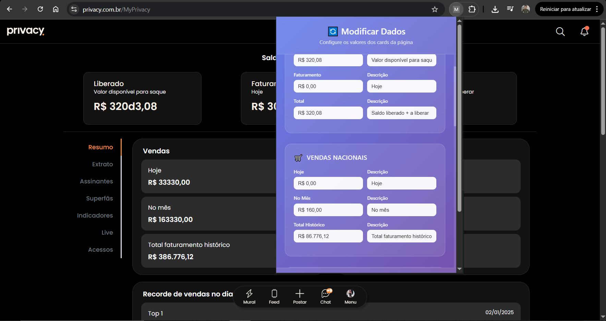

# 🔄 Privacy Content Extension

[](https://opensource.org/licenses/MIT)
[](https://chrome.google.com/webstore)
[](https://github.com/kaikyPx/privacy-data-modifier)

Uma extensão do Chrome que permite modificar visualmente os dados dos cards de estatísticas em páginas web, ideal para demonstrações e portfólios de gerenciadores de contas.



## ✨ Características

- **Modificação Visual**: Altera dados de cards de estatísticas em tempo real
- **Interface Intuitiva**: Popup com interface moderna e responsiva
- **Persistência**: Dados mantidos mesmo após recarregar a página
- **Múltiplas Seções**: Suporte para dados financeiros, vendas, tops, projeções e assinantes
- **Validação**: Sistema robusto de validação de dados
- **Loading States**: Feedback visual durante as modificações

## 🚀 Instalação

1. **Clone o repositório**:
   ```bash
   git clone https://github.com/yourusername/privacy-data-modifier.git
   cd privacy-data-modifier
   ```

2. **Abra o Chrome** e vá para `chrome://extensions/`

3. **Ative o "Modo do desenvolvedor"** no canto superior direito

4. **Clique em "Carregar sem compactação"** e selecione a pasta do projeto

5. **A extensão será instalada** e aparecerá na barra de ferramentas

## 📖 Como Usar

1. Navegue até a página que contém os cards de estatísticas
2. Clique no ícone da extensão na barra de ferramentas
3. Configure os dados desejados no popup
4. Clique em "✅ Aplicar Modificações"
5. Os dados serão atualizados instantaneamente na página

## 🏗️ Estrutura do Projeto

```
privacy-data-modifier/
├── manifest.json          # Configuração da extensão
├── content.js            # Script principal de modificação
├── popup.html            # Interface do popup
├── popup.js              # Lógica do popup
├── README.md             # Documentação principal
├── LICENSE               # Licença MIT
└── .gitignore            # Arquivos ignorados pelo Git
```

## 🛠️ Tecnologias

- **JavaScript ES6+**: Lógica principal
- **HTML5**: Estrutura da interface
- **CSS3**: Estilização moderna
- **Chrome Extensions API**: Integração com o navegador
- **Manifest V3**: Última versão do sistema de extensões

## 📄 Licença

Este projeto está licenciado sob a Licença MIT - veja o arquivo [LICENSE](LICENSE) para detalhes.

## 📞 Suporte

- **Issues**: [GitHub Issues](https://github.com/yourusername/privacy-data-modifier/issues)
- **Email**: seuemail@exemplo.com

---

<div align="center">

**⭐ Se este projeto te ajudou, considere dar uma estrela! ⭐**

</div>